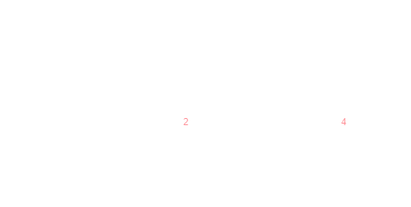

# MeshProject

>To run the program, you'll need Java 17 or a later version.

>The latest version can be found on the mesh-6 branch, which is either the most recent or the initial solution available on the main branch.

>One issue I faced before was that:
>>Consider the scenario where we have a local maximum for the selected element because none of its neighbors has a higher value than itself. 
> However, in this case, the selected element's indirect neighbor with ID 3 has a value higher than the selected element with ID 4.
> Because we do not have any element that can break the connection with a lower value than the value of ID 4, ID 4 is not a local maximum.
> And in that case, it can't be inserted into the list. The same applies to the element with ID 2.

>Another issue was that I couldn't tell if any indirect neighbors were in the list.
>> I could only insert one local maximum with the same value. I checked if the neighbors were already inserted but forgot about the indirect neighbors.
This problem has also been resolved.